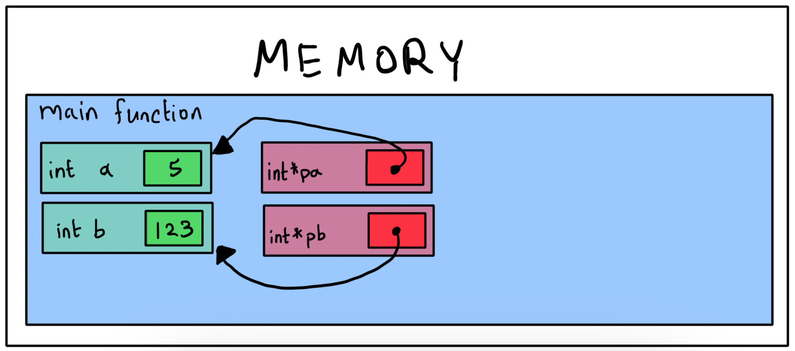
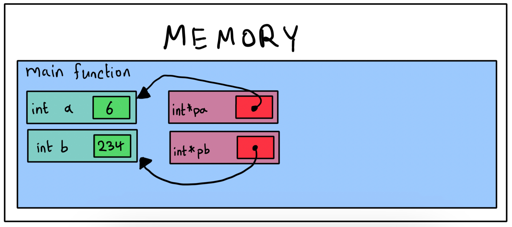
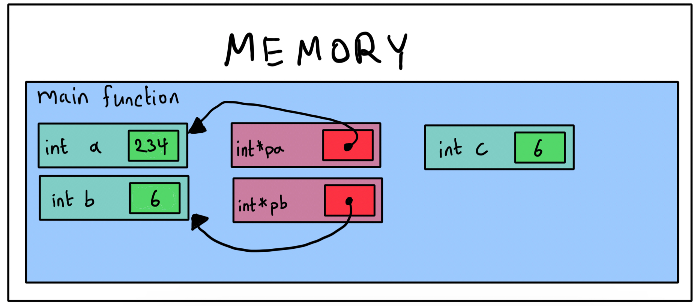
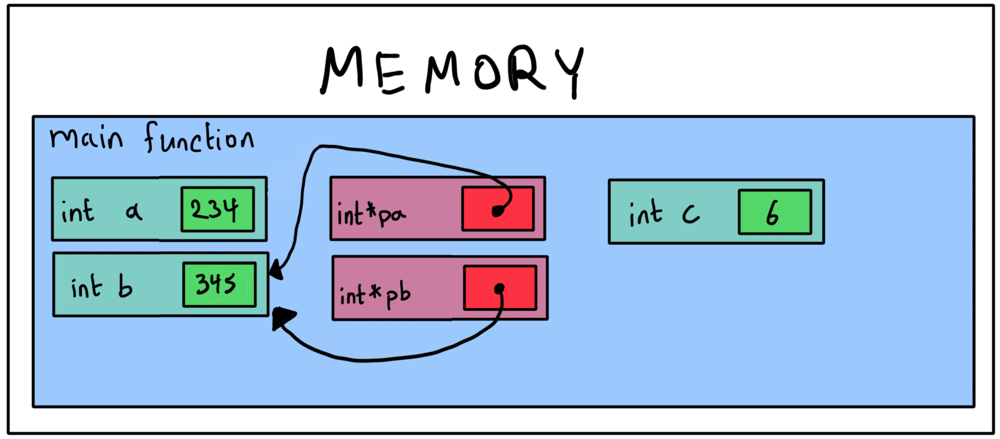

#  Pointers Revision

1. Using a diagram, show how the state of memory changes after each line of code is executed.

    ```c
    int main(void) {
        int a = 5;
        int b = 123;
    
        int *pa = &a;
        int *pb = &b;
    
        *pa = 6;
        *pb = 234;
    
        int c = *pa;
        *pa = *pb;
        *pb = c;
    
        pa = pb;
        *pa = 345;
    }
    ```

    #### Answer

    After line 6:

    

    After line 9:

    

    After line 11:

    

    After line 12:

    

    After line 13:

    

    After line 15:

    

    After line 16:

    

2. Explain why the swap() function here does not work as intended:

    ```c
    int main(void) {
        int a = 5;
        int b = 7;
        swap(a, b);
        printf("a = %d, b = %d\n", a, b);
    }
    
    void swap(int a, int b) {
        int tmp = a;
        a = b;
        b = tmp;
    }
    ```

    Modify the code so that it works as intended. Show how the new version works using a diagram.
    
    #### Answer
    
    `a` and `b` are passed by copy into `swap`, which then modifies its own local copies of these variables but not the ones in `main`. The fix is to pass these variables by reference instead.
    
    ```c
    int main(void) {
        int a = 5;
        int b = 7;
        swap(&a, &b);
        printf("a = %d, b = %d\n", a, b);
    }
    
    void swap(int *a, int *b) {
        int tmp = *a;
        *a = *b;
        *b = tmp;
    }
    ```
    
    
