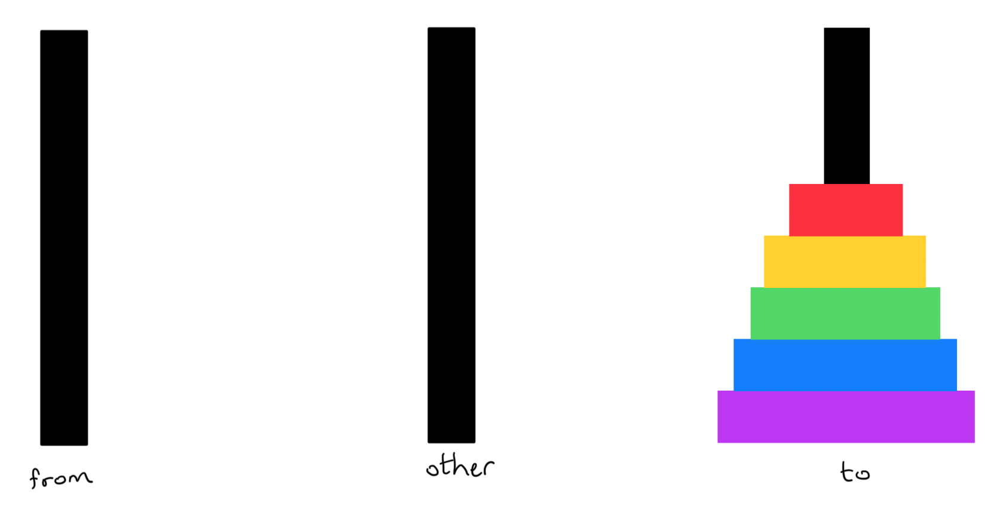
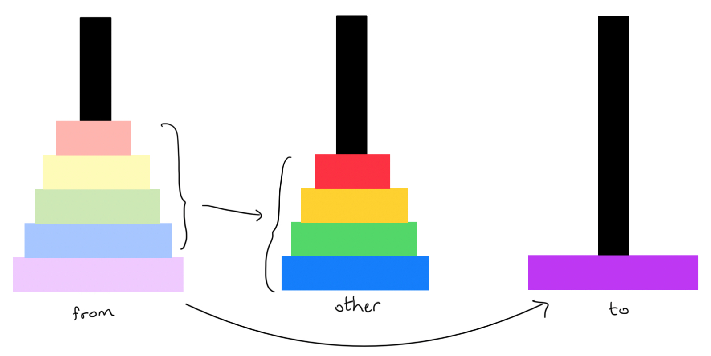
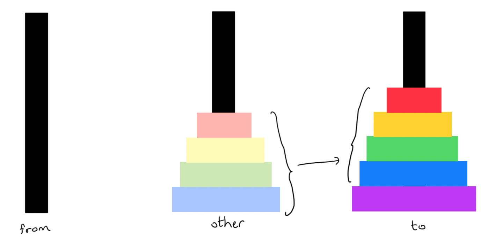

# Recursion

For the questions below, use the following data type:

```c
struct node {
    int value;
    struct node *next;
};
```

1.  Write a recursive function to compute the length of a linked list. It should have this signature:

    ```c
    int listLength(struct node *l) {
        // base case
        if (l == NULL) return 0;
        
        // recursive case
        return 1 + listLength(l->next);
    }
    ```
    
2.  Write a recursive function to count the number of odd numbers in a linked list. It should have this signature:

    ```c
    int listCountOdds(struct node *l) {
        if (l == NULL) return 0;
    
        return (l->value % 2) + listCountOdds(l->next);
    }
    ```
    
3.  Write a recursive functions to check whether a list is sorted in ascending order. It should have this signature:

    ```c
    bool listIsSorted(struct node *l) {
        if (l == NULL || l->next == NULL) {
            return true;
        }
    
        // we have at least 2 nodes if we get here
        if (l->next->value < l->value) {
            return false;
        }
        
        return listIsSorted(l->next);
    }
    ```
    
4.  Write a recursive function to delete the first instance of a value from a linked list, if it exists. The function should return a pointer to the beginning of the updated list. Use the following interface:

    ```c
    struct node *listDelete(struct node *l, int value) {
        if (l == NULL) return l;
        
        if (l->value == value) {
            struct node *rest = l->next;
            free(l);
            return rest;
        }
        
        l->next = listDelete(l->next, value);
        return l;
    }
    ```
    
5.  Recall that an alternative representation of a linked list uses a struct that contains a pointer to the first node of the list:

    ```c
    struct list {
        struct node *head;
    };
    ```

    How would your recursive solutions for the above questions change if the functions took a `struct list` pointer instead of a node pointer? For example:

    ```c
    int listLength(struct list *list) {
        return doListLength(list->head);
    }
    
    int doListLength(struct node *n) {
        if (!n) return 0;
        return 1 + doListLength(n->next);
    }
    ```
    
6.   The Tower of Hanoi is a puzzle consisting of three rods (Rod A, B and C) and disks of various sizes. The disks are initially stacked on Rod A from largest (at the bottom) to smallest (at the top), and the goal is to move all the disks onto Rod C, while following these rules:

     -   Only one disk can be moved at a time
     -   A larger disk cannot be placed on top of a smaller disk

     

     
     
     Write a function that prints out instructions to complete the puzzle. The function should take in the number of disks, and the names of the three rods (A, B and C).
     
     For example, for three disks, the function call `solveHanoi(3, "A", "C", "B")` should print the following:

     ```
     Move disk from Rod A to Rod C
     Move disk from Rod A to Rod B
     Move disk from Rod C to Rod B
     Move disk from Rod A to Rod C
     Move disk from Rod B to Rod A
     Move disk from Rod B to Rod C
     Move disk from Rod A to Rod C
     ```

     ```c
     void solveHanoi(int numDisks, char *fromRod, char *toRod, char *otherRod) {
         if (numDisks == 0) {
             return;
         }

         solveHanoi(numDisks - 1, fromRod, otherRod, toRod);
         printf("Move disk from Rod %s to Rod %s\n", fromRod, toRod);
         solveHanoi(numDisks - 1, otherRod, toRod, fromRod);
     }
     ```
    
     Approach:
    
     Shift everything except for the bottom disk onto the other pole. Then move the bottom disk to the destination pole.
    
     
    
     Move all remaining disks from the other pole to the destination pole.
    
     

